# Devi for GitHub Copilot 操作手册

**Devi for GitHub Copilot** 是构建在 GitHub Copilot 生态体系上的一系列 AI智能体，devi提供了这些智能体的原子能力，并通过 GitHub Copilot Chat 为开发者提供服务。

代维DB智能体（devi DB agent）是我们首批发布的智能体组件，可以为开发者提供智能数据库问答和 Text2SQL 的自然语言数据库查询能力。

## 安装插件

Devi for GitHub Copilot 插件是一个 Visual Studio Code 插件，您可以通过以下步骤安装插件：

1. 打开 Visual Studio Code，点击左侧的 `扩展` 图标, 在搜索框中输入 `Devi`，找到 `Devi for GitHub Copilot` 插件并点击 `安装` 安装插件。

    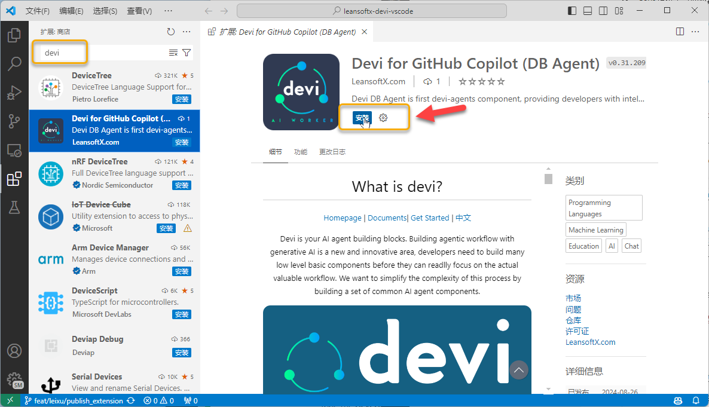


2. 或者您也可以通过 Visual Studio Marketplace 下载插件安装包并手工安装

    下载地址：[Devi for GitHub Copilot](https://marketplace.visualstudio.com/items?itemName=leansoftx.leansoftx-devi-copilot)

> 安装完成后建议重新启动 Visual Studio Code 以确保插件正常加载。

## 初始化环境

插件安装完毕后，需要完成以下两个简单的步骤才可以开始使用：

1. 通过调用 `下载模型` 任务下载**嵌入模型**。

    您可以通过按 `Ctrl+Shift+P` 打开命令面板并键入 `Download Model`来下载嵌入模型。

    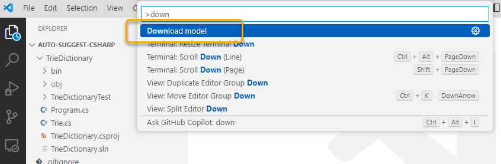

    下载模型需要一段时间，这个过程中VSCode会有相应的提示。

    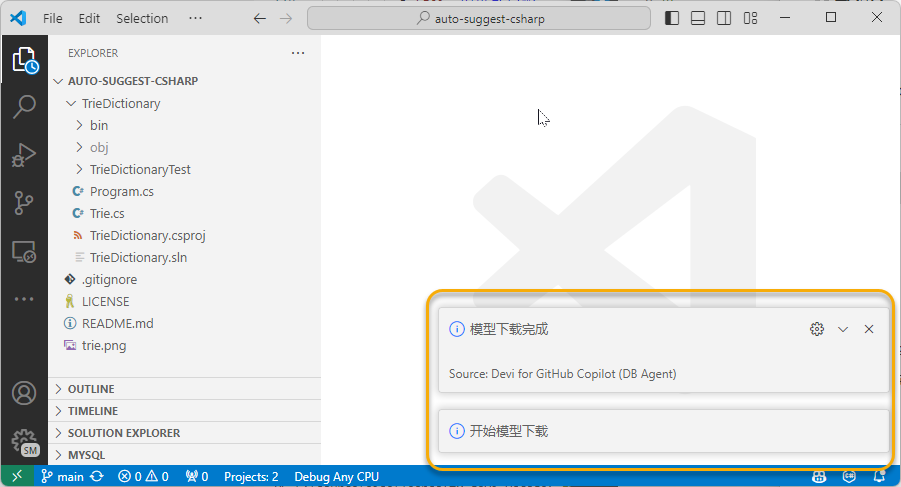

    下载完成的模型文件会被保存在 `~/.devi` 目录下，后续再使用过程中或者升级插件时，不需要再次下载。

2. 通过编辑 `Settings. json` 文件来设置数据库连接。

    在菜单种点击 `文件` -> `首选项` -> `设置` 打开 `Settings. json` 文件。

    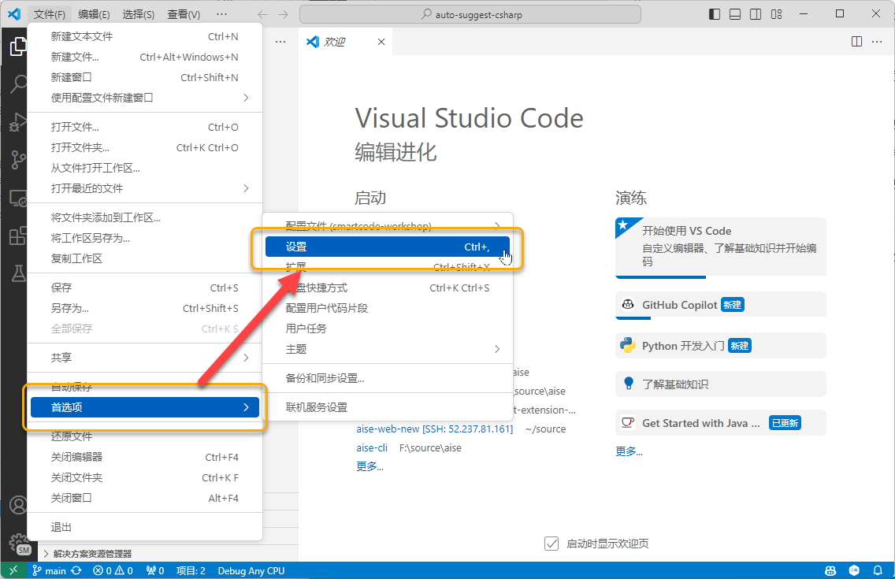

    在设置页面中输入 `devi` 搜索关键字，并点击 `Edit in settings.json`。

    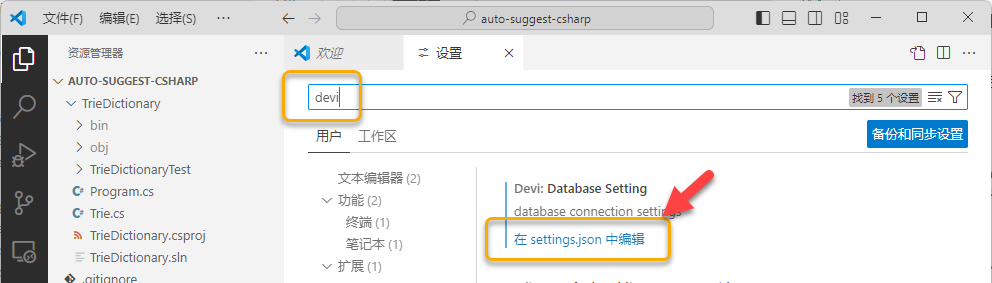

    在 `Settings. json` 文件中添加 `devi.databaseSetting` 配置项，配置项的内容包括数据库的连接信息，

    以下是 `Setings. json` 文件的示例：

    ```json
        "devi.databaseSetting": {    
            "database": "test_db",
            "host": "localhost",
            "port": 3306,
            "user": "root",
            "password": "your password",
            "type": "mysql"
        },  
    ```

   输入完成，保存即可。
    

## 数据库智能问答

Devi DB Agent 可以为您提供数据库智能问答的能力，用户可以在 GitHub Copilot Chat 中通过 `@devi` 的方式唤起 Devi DB Agent，然后输入您的问题，Devi DB Agent 会为您提供答案。

首先，开启 GitHub Copilot Chat，然后输入 `@devi` 唤起 Devi DB Agent：

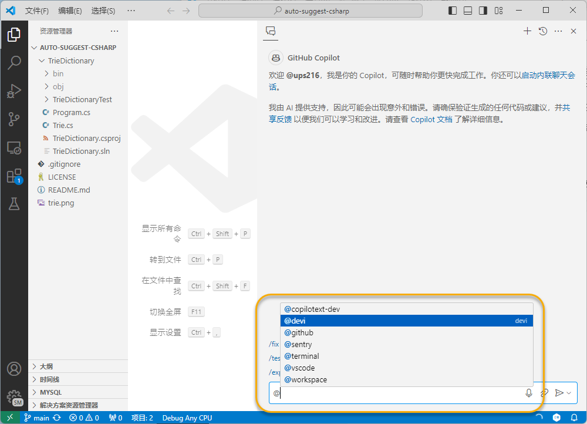

在以上列表中选择 `@devi` 智能体后，即可在后面输入您的问题：

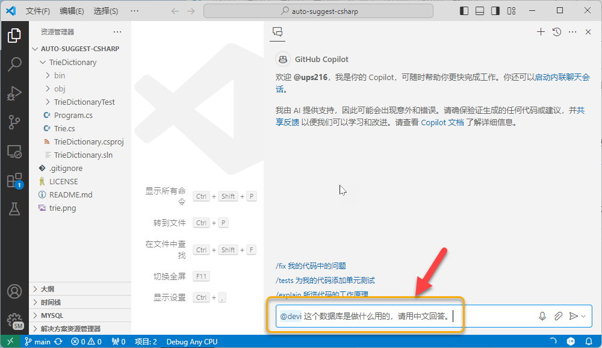

如果是第一次使用，GitHub Copilot会询问您是否允许自定义Agent使用 Copilot 服务，请点击 `允许`，此时 Devi DB Agent 会自动连接您的数据库并启动向量索引操作。

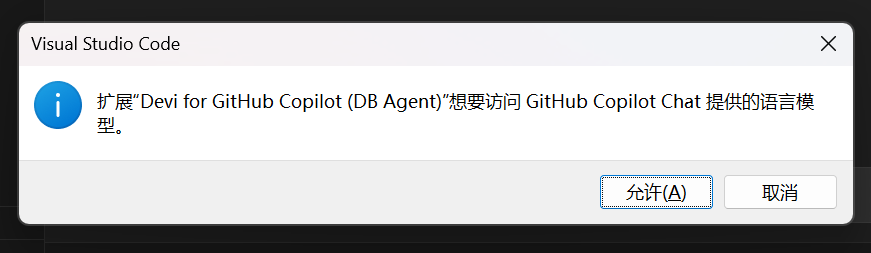

如果前面正确配置了数据库连接信息，Devi DB Agent 会自动连接您的数据库并启动向量索引操作，这个过程根据您本地计算机的性能和数据库的大小可能需要一段时间。如果您的数据库连接信息有误，Devi DB Agent 会提示您输入正确的数据库连接信息。

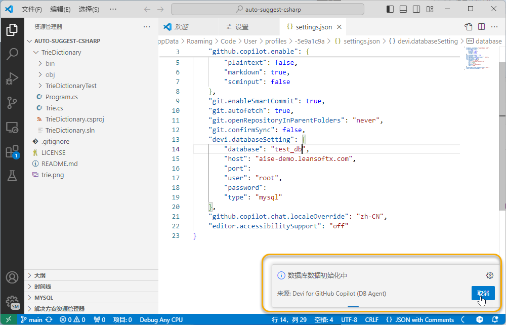

Devi DB Agent 会为您提供问题的答案：

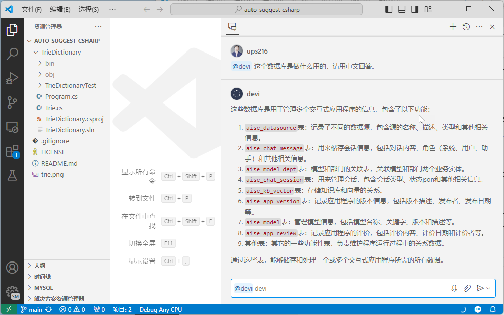

你还可以尝试以下问题，这些问题对任何数据库都适用，通过这些问题可以了解Devil DB Agent的能力，更重要的是，如果您正在尝试了解一个没有接触过的数据库，这些问题可以帮助您快速了解数据库的结构和内容。

- 这个数据库是做什么用的？
- 这个数据库有多少表？分别是哪些？都能做些什么？
- 这个数据库中哪些表之间存在关联？请对这些关联进行说明解释。

## 自然语言生成数据库查询（Text2SQL）

Devi DB Agent 内置了斜杠快捷指令 `/query`，可以为您提供自然语言生成数据库查询的能力。用户只需要输入自己的要求，Devi DB Agent 会自动检索相关数据库对象定义，并生成相应的 SQL 查询语句。

> 以下查询仅为示例，用户需要根据自己所连接的数据库的情况提出问题。

用户输入：`@devi` `/query` 获取评分最高的10个应用

Devil DB Agent 会自动为您生成 SQL 查询语句以及相关的解释：

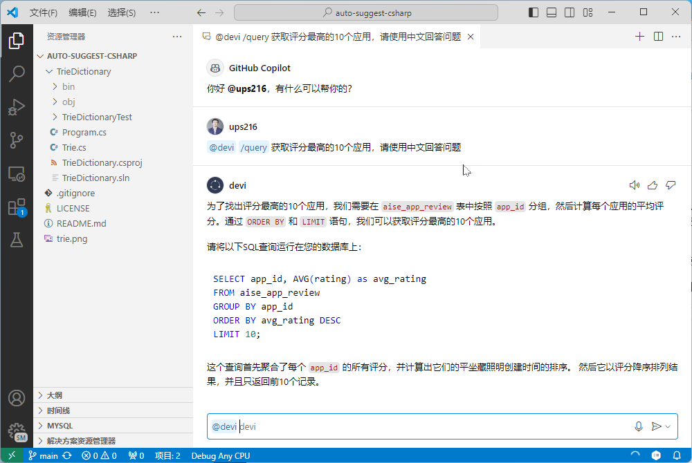


## 数据库文档生成

编写数据库文档是一个繁琐的工作，Devi DB Agent 可以为您提供数据库文档生成的能力，用户只需要输入需要生成文档的数据库表的名称，Devi DB Agent 会自动为您生成数据库文档。

> 以下查询仅为示例，用户需要根据自己所连接的数据库的情况提出问题。

用户输入：`@devi` `/docs` 

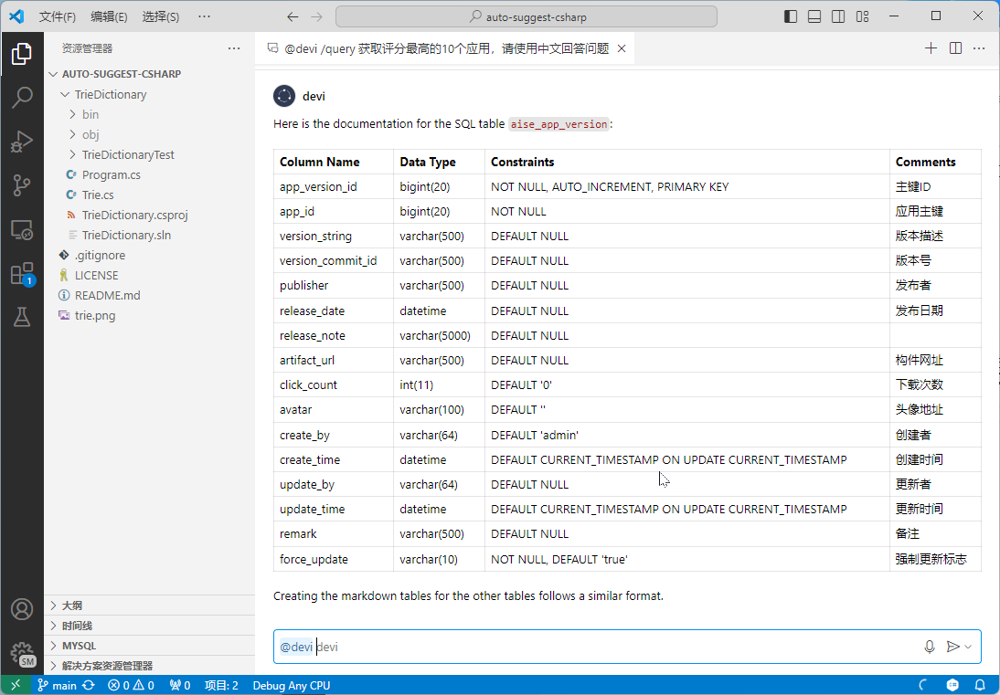


# 问题反馈

如果您在使用过程中遇到任何问题，或者有任何建议，欢迎通过以下方式联系我们：

- 中文 [Gitee Issues](https://gitee.com/devi-run/devi-github-copilot-extension/issues)
- 英文 [GitHub Issues](https://github.com/devi-run/devi-github-copilot-extension/issues)
